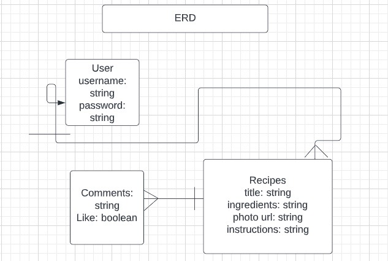

USER STORY  
1. I want to open the home page to view recipes
2. I want to be able to submit a recipe
    - new Schema
    - create a model to use
    - return a newly created recipe
3. I want to be able view that recipe
    - query for a single recipe
    - return said recipe
4. I want to update my recipe 
    - query for a single recipe
    - update that recipe
    - return update recipe
5. I want to delete my recipe
    - query for a single recipe
    - delete or remove recipe
    - return a success
6. I want to be able to search for recipes
    - utilize a search bar
7. I want to be able to see recipes divided into categories

WIRE FRAMES
1. 
2. 
3. 
4. 
5. 
6. 
7. 
8. 

RECIPE ROUTES
NAME:   | PATH:            | HTTP VERB: | PURPOSE:
Index   | /recipes         | GET        | Displays home page of recipes
New     | /recipes/new     | GET        | Shows new form for new recipe entry
Create  | /recipes         | POST       | Creates new recipe
Show    | /recipes/:id     | GET        | Shows one specific recipe
Edit    | /recipes/:id/edit| GET        | Shows edit form for one recipe
Update  | /recipes/:id     | PUT        | Updates a particular recipe
Destroy | /recipes/:id     | DELETE     | Deleted a particular recipe

ERD:
1. 

SCHEMA: (model)
- Recipe Resource
    - title: { type: String, required: true },
    - author: { type: String, required: true },
    - body: String,
    - publishDate: { type: Date, default: Date.now },
    - ** add timestamps as true for best practice