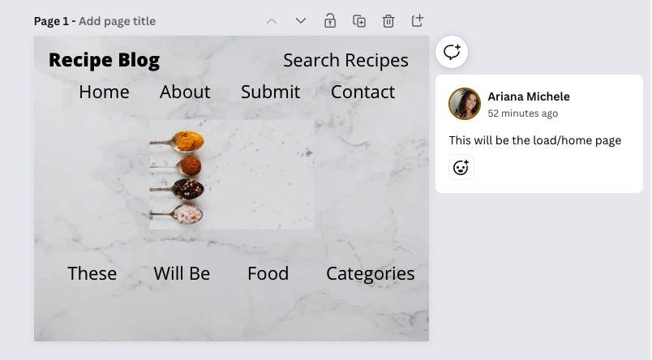
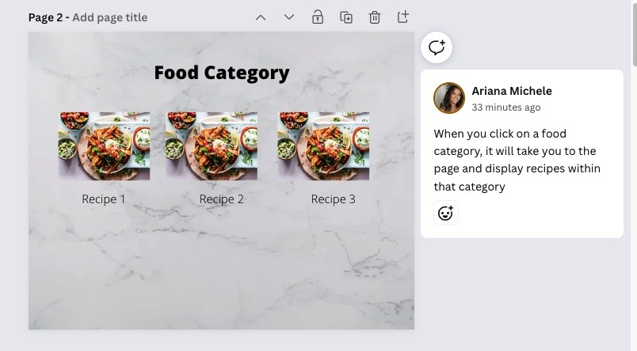
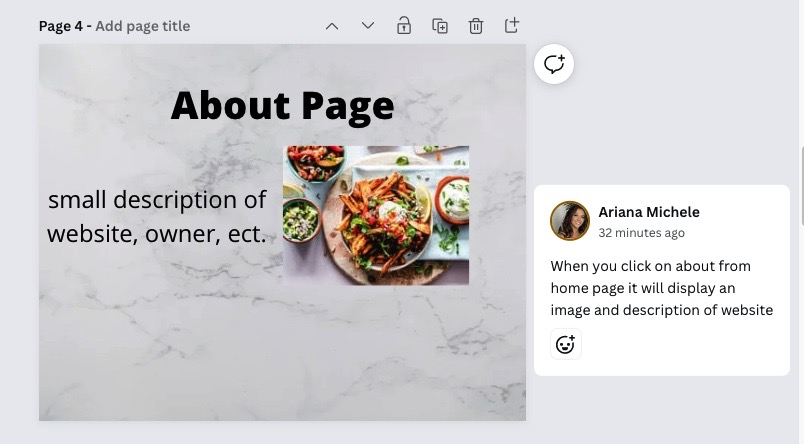
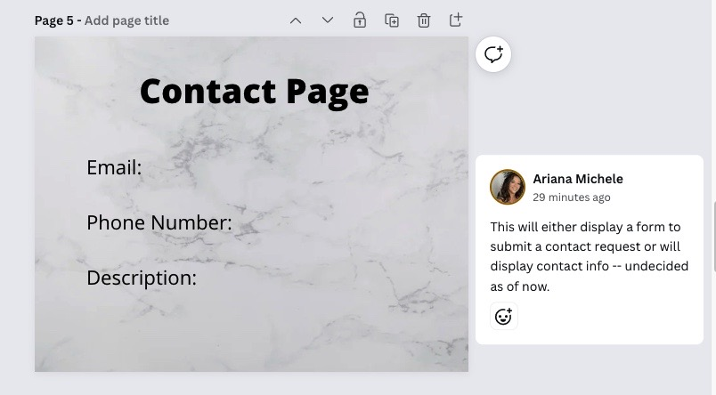
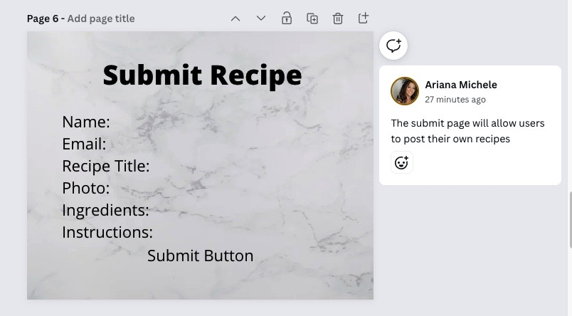
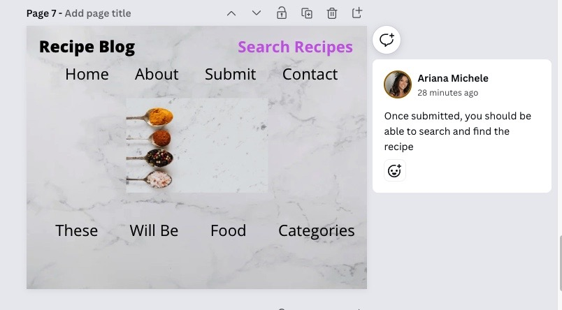
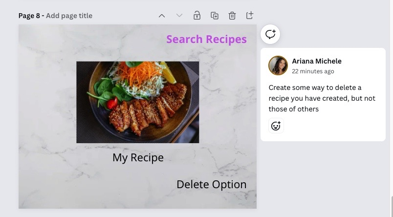
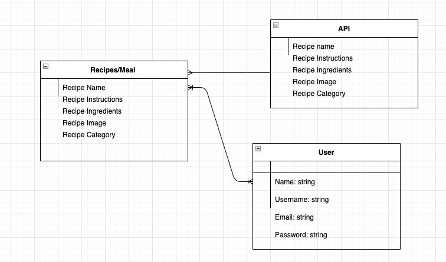

# RECIPE BLOG 
A recipe blog where users can sign up, login, and post their own recipes to the application. They can also search for other recipes created by others.

---
### WEB APPLICATION URL DEPLOYED ON HEROKU
https://recipeblogbyariana.herokuapp.com/
- - - 
#### UTILIZED TECHNOLOGIES
- Backend: Node Js & Express Js
- Frontend: HTML, CSS, JavaScript 
- Database: MonogDB
- API: https://www.themealdb.com/api.php
___
##### HOW TO RUN LOCALLY
- run `npm install` in terminal in order to install all dependencies
- run `npm i nodemon` to install nodemon as dev dependency to run server
- set up the following environment variables
  - MONGO_URI
  - SESSION_KEY
  - GOOGLE_CLIENT_ID (to be continued)
  - GOOGLE_CLIENT_SECRET (to be continued)
- run `npm start` to run the server locally
** This application runs on localhost://4000 **
---
### USER STORY  
1. I want to open the home page to view recipes
2. I want to be able to search for recipes
   - utilize a search bar
3. I want to be able to sign up
4. I want to be able to login
5. I want to be able to submit a recipe
6. I want to be able view that recipe
7. I want to update my recipe 
8. I want to delete my recipe
9. I want to be alble to find my recipe through the search bar
10. I want to be able to log out successfully
---
### WIRE FRAMES
1. 
2. 
3. 
4. 
5. 
6. 
7. 
8. 
---
### ERD:
1. 
---
#### CATEGORY ROUTES
| NAME:   | PATH:                   | HTTP VERB:|PURPOSE:                      |
|---------|-------------------------|------------|-----------------------------|
| Index   | /                       | GET       | Displays all categories      |
| New     | /:category              | GET       | Shows specific category      |
| Show    | /:category/:mealID/:meal| GET       | Shows one meal within recipe category|

#### RECIPE ROUTES
| NAME:   | PATH:             | HTTP VERB: | PURPOSE:                              |
|---------|-------------------|------------|---------------------------------------|
| Index   | /                 | GET        | Displays home page of recipes         |
| Show    | /dashboard        | GET        | Shows authorized users dashboard      |
| Create  | /submit-recipe    | GET        | Creates new recipe                    |
| Show    | /search           | POST       | Shows recipes that match the search   |
| Show    | /user/meal/:mealID| GET        | Get recipes by the user               |
| Update  | /user/meal/edit/:mealID| PATCH       | Updates a particular recipe     |
| Destroy | /user/meal/edit/:mealID | DELETE     | Deletes a particular recipe     |

#### USER ROUTES
| NAME:   | PATH:       | HTTP VERB: | PURPOSE:                              |
|---------|-------------|------------|---------------------------------------|
| Index   | /login      | GET        | Displays login in page                |
| New     | /register   | CREATE     | Creates new user entry                |
| Create  | /logout     | POST       | Logs out user, redirectss back to homepage |
---
######STRETCH GOALS:
 - give users the ability to leave reviews on recipes
 - give users the ability to add other's recipes to their dashboard
 - give user the ability to upload their own images and/or videos
    - created areas, but not functioning
- get google auth fully functional to allow users to login with google credentials
